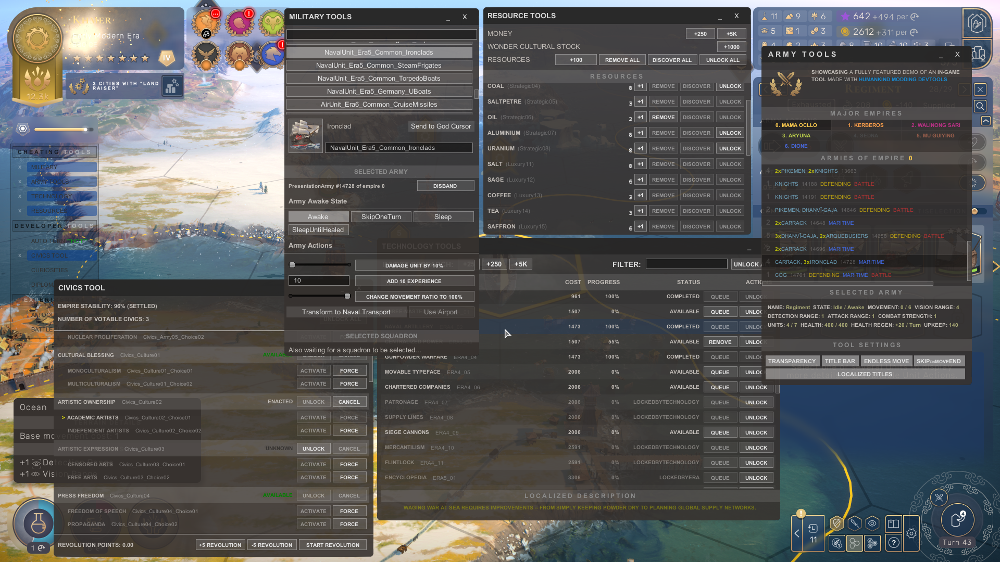
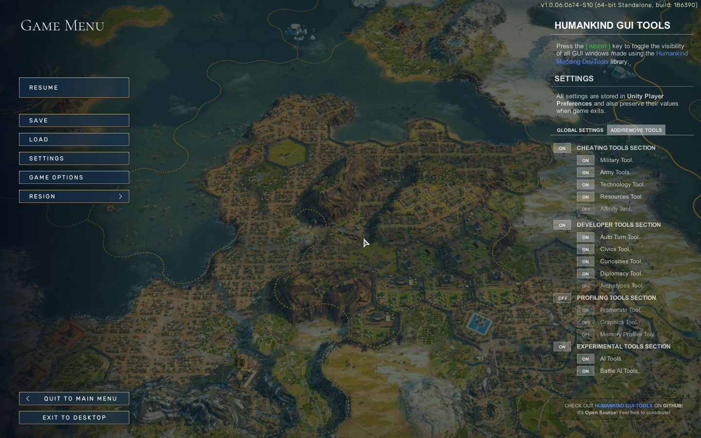

# **HUMANKIND GUI TOOLS**

**A MOD FOR THE AMPLITUDE STUDIOS <a href="https://humankind.game/" title="Humankind Official Website" target="_blank"></a> GAME**

###### **PROJECT PAGE [ON GITHUB](https://github.com/Theadd/Humankind-GUI-Tools)**

 

## **FEATURES**

* Manage the **resources** of your empire, money, influence, strategic and luxury resources.
* Unlock/Enact/Cancel any **civic** in the game.
* Unlock/Manage all **technologies**.
* **Infinite movement** for your units *(while `Army Tools` window is visible)*.
* With the `Auto Turn Tool`, you can allow the **AI** to control your empire and watch it evolve at high speed for a specified number of turns *(The [AOM.Humankind.FasterBattleAnimationSpeed](https://gc2021.com/showthread.php?tid=41) mod is very useful when played together with this tool)*.
* And many more tools for you to play with.

 

## **DOWNLOAD AND INSTALL**

> This mod requires **BepInEx** to be installed in your game directory. If you don't have it, you can follow [this guide](https://gc2021.com/showthread.php?tid=4).

* Download and unpack [DevTools.Humankind.GUITools.v1.1.0.zip](https://github.com/Theadd/Humankind-GUI-Tools/releases/download/v1.1.0/DevTools.Humankind.GUITools.v1.1.0.zip) into your game directory.
* Run the game.

 

## **SCREENSHOTS**

 

### **PERSISTENT SETTINGS**

 

## **SUMMARY**

When decompiling the Humankind assemblies back to source code we found **100+ hidden utility tools** used by Amplitude Studios to test, profile and develop the game.

Many of them are **a must have for mod developers** in order to test their mod in many different scenarios since they allow us to advance to a desired game state in no time.

From those 100+ hidden tools we only had the time to test 20-25 of them, of which only ~15 of them are successfully adapted and available right now. There are still many tools to check!
<h5>

<strong>NAMES OF THE 100+ HIDDEN TOOLS FOUND</strong>

<blockquote>

`LocalizationFloatingWindow, Widget, ClockWidget, MemoryProfilerWindow, ProfilerWindow, FxComponentEvolveProfilingWindow, FxOutputLayerProfilingWindow, GPUProfilerWindow, GraphicsTools, UnityProfilerLoggingWindow, RenderPipelineAuditWindow, AffinityUtils, AI, AICursor, AirStrikeReport, Archetypes, AudioEvents, AudioScale, Avatar, BattleAI, BattleExternalSupport, BattleParticipants, BattleReport, BiomeAudio, BlackList, CameraMover, CameraSequence, ChallengeRewards, ChallengeViewer, Chat, ChoreographyActions, CityAudio, CivicsUtils, Collectible, Diplomacy, DiplomaticLog, DisplaySettings, DistrictPainter, DownloadableContent, Droppables, EffectMapperDebugger, ostModifierEvaluationDebugger, DescriptorEvaluationDebugger, DistrictEvaluationDebugger, EndGameFlow, EndTurnTimer, FameRankingUtility, FameUtils, Framerate, GameClientConnections, GameClientServer, Ideology, InputFilter, MapEditor, MapSharing, Marketing, Metadata, MilitaryCheats, MinorFaction, ModPlaylist, NarrativeEventDebugger, NetworkStatistics, NetworkSynchronization, OrderStatistics, Physics, Ping, PlayerProfile, Pollution, PresentationCursor, RansackCursor, ReligionUtils, RemoteSandboxes, ResourcesUtils, SessionSlots, SessionUsers, SettlementUtils, SnapshotStatistics, Squadrons, StateShareUtils, StatisticsAndAchievements, Surrender, TechnologyUtils, TerrainAudioModule, TerrainPicking, TimemapDebugger, Trade, TradeNodeUtils, Trophies, TutorialFakeWindow, TutorialInfo, TwitchExtension, WorldGeneration, WorldLifeDebugger, CustomMap, ScenarioEditor, BattleDebug, PawnAnimation, Pawns, CameraLayersWindow, ProceduralTerrainRendererWindow, UIVirtualScreenTester, UISettingsOverlayWindow, UIUtils, AudioOptions, AutoTurn, Dump, EmpireWideConstructionUtils, GameInfo, NetworkDebugger, SandboxStatus, TerritoryUtils`
</blockquote>

</h5>

 

### **CONTRIBUTING**

Would you like to help? [Check this out](/CONTRIBUTING_GUIDE.md).

 

### **KNOWN ISSUES**

* Not checked recently, but the [Modding.Humankind.DevTools](https://github.com/Theadd/Modding.Humankind.DevTools) libary played along with the [AOM.Humankind.Teams](https://gc2021.com/showthread.php?tid=43) mod was making the game to crash on start.
